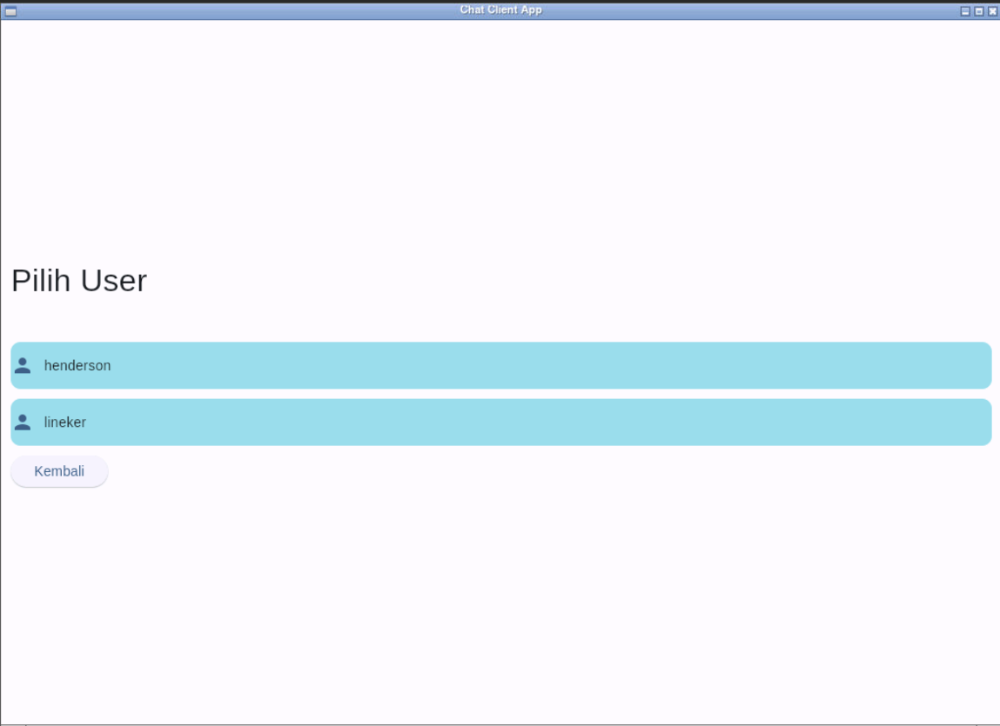
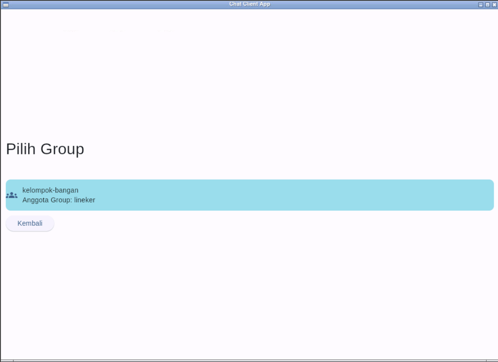

# Final Project Pemrograman Jaringan E

## Kelompok Bagan

## Anggota Kelompok

| Nama                   | NRP        | Pembagian Tugas 6                       |
| ---------------------- | ---------- | --------------------------------------- |
| Akbar Putra Asenti P.  | 5025211004 | Protokol Menu, Authentication, dan Chat |
| Achmad Khosyi' A. R.   | 5025211007 | Protokol Realm                          |
| Arkana Bilal Imani     | 5025211034 | Protokol Chat                           |
| Abdullah Yasykur B. M. | 5025211035 | Protokol Group Chat                     |
| Muhammad Zien Zidan    | 5025211122 | Protokol Group Chat                     |
| Ariella Firdaus Imata  | 5025211138 | Protokol Private Chat dan Inbox         |

| Nama                   | NRP        | Pembagian Tugas Final Project       |
| ---------------------- | ---------- | ----------------------------------- |
| Akbar Putra Asenti P.  | 5025211004 | Flet Menu, Authentication, and Chat |
| Achmad Khosyi' A. R.   | 5025211007 | Flet Realm                          |
| Arkana Bilal Imani     | 5025211034 | Flet Chat                           |
| Abdullah Yasykur B. M. | 5025211035 | Flet Group Chat                     |
| Muhammad Zien Zidan    | 5025211122 | Flet Group                          |
| Ariella Firdaus Imata  | 5025211138 | Flet Private Chat dan Inbox         |

### Set up

lakukan set up pada terminal dahulu

```
sudo apt-get update
```

```
pip install flet
```

```
sudo apt install libmpv-dev -y
```

## 1. Pengujian Awal dari komunikasi

## 2. Definisi Protokol Chat

Berikut merupakan Protokol yang kami gunakan

```
# DEFINISI PROTOKOL

## Inter-Realm

### LOGIN
* Perintah: auth <username> <password>
* Penggunaan: Autentikasi user
* Response:
	- Berhasil:
		- status: OK
		- tokenId: tokenId
	- Gagal:
		- status: ERROR
		- message: User tidak ada | Password salah

### REGISTER
* Perintah: register <username> <password> <negara> <nama>
* Penggunaan: Registrasi user baru
* Response:
	- Berhasil:
		- status: OK
		- tokenId: tokenId
	- Gagal:
		- status: ERROR
		- message: User sudah ada

### BUAT GRUP
* Perintah: addgroup <nama_group>
* Penggunaan: Membuat grup baru
* Response:
	- Berhasil:
		- status: OK
		- message: Add group Berhasil
	- Gagal:
		- status: ERROR
		- message: Group sudah ada | Session tidak ditemukan

### JOIN GRUP
* Perintah: joingroup <nama_group>
* Penggunaan: Bergabung ke grup
* Response:
	- Berhasil:
		- status: OK
		- message: Join group berhasil
	- Gagal:
		- status: ERROR
		- message: Group belum ada | User sudah join | Session tidak ditemukan

### MENGIRIM PESAN
* Perintah: send <username to> <message>
* Penggunaan: Mengirim pesan privat ke user lain
* Response:
	- Berhasil:
		- status: OK
		- message: Message sent
	- Gagal:
		- status: ERROR
		- message: User tidak ada | Session tidak ditemukan

### MENGIRIM FILE
* Perintah: sendfile <username to> <filename>
* Penggunaan: Mengirim file ke user lain
* Response:
	- Berhasil:
		- status: OK
		- message: File sent
	- Gagal:
		- status: ERROR
		- message: File tidak ditemukan | Session tidak ditemukan

### MENGIRIM PESAN KE GRUP
* Perintah: sendgroup <nama_group> <message>
* Penggunaan: Mengirim pesan ke grup
* Response:
	- Berhasil:
		- status: OK
		- message: Message sent
	- Gagal:
		- status: ERROR
		- message: Group tidak ditemukan | User bukan member grup | Session tidak ditemukan

### MENGIRIM FILE KE GRUP
* Perintah: sendgroupfile <nama_group> <filename>
* Penggunaan: Mengirim file ke grup
* Response:
	- Berhasil:
		- status: OK
		- message: File sent
	- Gagal:
		- status: ERROR
		- message: File tidak ditemukan | Group tidak ditemukan | User bukan member grup | Session tidak ditemukan

### MELIHAT PESAN
* Perintah: inbox
* Penggunaan: Melihat pesan yang diterima
* Response:
	- Berhasil:
		- status: OK
		- messages: Daftar pesan
	- Gagal:
		- status: ERROR
		- message: Session tidak ditemukan

### LOGOUT
* Perintah: logout
* Penggunaan: Logout dari sistem
* Response:
	- Berhasil:
		- status: OK
		- message: Logout berhasil
	- Gagal:
		- status: ERROR
		- message: Session tidak ditemukan

### MELIHAT USER YANG AKTIF
* Perintah: info
* Penggunaan: Melihat daftar user yang aktif
* Response:
	- Berhasil:
		- status: OK
		- message: Daftar user yang aktif
	- Gagal:
		- status: ERROR
		- message: Tidak ada user yang aktif
```

### 2.1 Private Message

lakukan login pada akun yang telah disediakan

sebagai contoh, kami menggunakan `messi` dan `henderson`

a. login menggunakan `messi`


b. setelah berhasil login, akan ditampilkan halaman utama yang memuat fitur (Private Chat, Group Chat, Add Group Chat dan Join Group Chat) dan juga token user

dan pilih fitur `Private Chat`


c. Setelah memilih fitur `Private Chat` akan ditampilkan pilihan user yang ingin dihubungi

sebagai contoh, kami memilih `henderson`



d. setelah memilih `henderson` akan ditampilkan room chat, kirim pesan sesuai yang di inginkan

sebagai contoh kami, mengirimkan pesan `halo, selamat malam` dan setelah mengisi chat room klik tombol `send` atau yang diwakilkan oleh logo `pesawat kertas`


e. Lakukan login pada akun `henderson`


f. setelah berhasil login akan ditampilkan halaman utama dan pilih `Private Chat`


g. Pilih `messi` untuk mengecek pesan teks yang sudah dikirimkan sebelumnya


h. Lakukan `inbox` atau diwakilkan logo `mail` untuk menerima pesan, jika berhasil akan muncul pesan yang sesuai

sebagai contoh, pesan yang dikirimkan `messi` adalah `halo, selamat malam` dan pesan tersebut muncul di room chat `henderson`


### 2.2 Group messaging

lakukan login pada akun yang telah disediakan

sebagai contoh, kami menggunakan `lineker` dan `henderson`

a. login menggunakan `lineker`


b. setelah berhasil login, akan ditampilkan halaman utama yang memuat fitur (Private Chat, Group Chat, Add Group Chat dan Join Group Chat) dan juga token user

dan pilih fitur `Group Chat` untuk melihat group yang telah ada atau join.


c. bisa diliat bahwa lineker sudah join di dalam Group `new` yang beranggotakan `messi` dan `henderson`


d. jika ingin membuat group baru dapat memilih fitur `Add Group Chat`dan tambahkan nama grup yang di inginkan

sebagai contoh, kami menggunakan nama `kelompok-Bagan`


e. jika berhasil membuat group akan ada keterangan `Add group successful`


f. bisa melakukan crosscheck di fitur `Group Chat`


g. lakukan login di akun `henderson` untuk memastikan bahwa grup yang telah dibuat oleh lineker ada di semua user


h. setelah berhasil login, akan ditampilkan halaman utama yang memuat fitur (Private Chat, Group Chat, Add Group Chat dan Join Group Chat) dan juga token user

dan pilih fitur `Join Group Chat` untuk melihat group yang telah dibuat oleh user lain.


i. berikut adalah daftar grup yang tersedia kemudian pilih grup yang ingin dimasuki



j. setelah memilih grup, user akan dikembalikan di halaman utama dan akan muncul pesan `Berhasil Join <nama grup>`. Jika ingin mengirim chat di grup yang baru, masuk ke `Group Chat` kemudian pilih grup yang akan di-chat, tulis pesan sesuai yang anda inginkan kemudian kirim.


k. akan muncul pesan yang baru anda kirim seperti berikut


l. lakukan crosscheck di user `lineker` pada grup `kelompok-bangan`. Akan muncul pesan dari `henderson` sebelumnya dikirimkan. Lakukan hal yang sama jika ingin membalas chat tersebut.


### 2.3 Send dan receive file

lakukan login pada akun yang telah disediakan

sebagai contoh, kami menggunakan `messi` dan `henderson`

a. login menggunakan `henderson`


b. setelah berhasil login, akan ditampilkan halaman utama yang memuat fitur (Private Chat, Group Chat, Add Group Chat dan Join Group Chat) dan juga token user

dan pilih fitur `Private Chat`


c. Setelah memilih fitur `Private Chat` akan ditampilkan pilihan user yang ingin dihubungi

sebagai contoh, kami memilih `messi`


d. setelah memilih `henderson` akan ditampilkan room chat, kirim file dengan menekan tombol `klip` di pojok kanan bawah.


e. akan muncul pop up seperti berikut. Tuliskan file yang ingin dikirimkan dan pilih `send file` untuk mengirim.


f. setelah berhasil mengirim akan muncul nama file dan preview dari file yang dikirimkan.


g. sekarang coba login pada akun `messi` untuk melihat apakah file yang dikirimkan oleh henderson berhasil diterima. Setelah masuk ke `private chat` dengan `henderson` tekan tombol `inbox` dan akan muncul file yang baru dikirimkan `henderson` tadi.


## 3. Definisi protokol dari pertukaran antar server dan antar realm

```
## Multi-Realm

### MENAMBAH REALM
* Perintah: addrealm <nama_realm> <address> <port>
* Penggunaan: Menambahkan realm baru
* Response:
	- Berhasil:
		- status: OK
		- message: Realm added
	- Gagal:
		- status: ERROR
		- message: Realm sudah ada | Realm Unreachable | Session tidak ditemukan

### MENGIRIM PESAN KE REALM
* Perintah: sendprivaterealm <name_realm> <username to> <message>
* Penggunaan: Mengirim pesan privat ke user di realm lain
* Response:
	- Berhasil:
		- status: OK
		- message: Message sent
	- Gagal:
		- status: ERROR
		- message: Realm tidak ditemukan | User tidak ada | Session tidak ditemukan

### MENGIRIM FILE KE REALM
* Perintah: sendfilerealm <name_realm> <username to> <filename>
* Penggunaan: Mengirim file ke user di realm lain
* Response:
	- Berhasil:
		- status: OK
		- message: File sent
	- Gagal:
		- status: ERROR
		- message: Realm tidak ditemukan | User tidak ada | File tidak ditemukan | Session tidak ditemukan

### MENGIRIM PESAN KE GROUP REALM
* Perintah: sendgrouprealm <name_realm> <nama_group> <message>
* Penggunaan: Mengirim pesan ke grup di realm lain
* Response:
	- Berhasil:
		- status: OK
		- message: Message sent
	- Gagal:
		- status: ERROR
		- message: Realm tidak ditemukan | Group tidak ditemukan | Session tidak ditemukan

### MENGIRIM FILE KE GROUP REALM
* Perintah: sendgroupfilerealm <name_realm> <nama_group> <filename>
* Penggunaan: Mengirim file ke grup di realm lain
* Response:
	- Berhasil:
		- status: OK
		- message: File sent
	- Gagal:
		- status: ERROR
		- message: Realm tidak ditemukan | Group tidak ditemukan | File tidak ditemukan | Session tidak ditemukan

### MELIHAT PESAN DARI REALM
* Perintah: getrealminbox <nama_realm>
* Penggunaan: Melihat pesan yang diterima dari realm lain
* Response:
	- Berhasil:
		- status: OK
		- messages: Daftar pesan
	- Gagal:
		- status: ERROR
		- message: Realm tidak ditemukan | Session tidak ditemukan
```

## 4. Arsitektur Implementasi


### 4.1 IP address

### 4.2 Port dari server

### 4.3 Cara menjalankan server dan client
